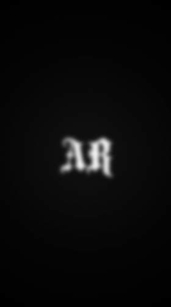

### README

Animación de introducción con un efecto visual (aparición del logo con desenfoque y una transición automática hacia el contenido de la página).

### Capturas

<table>
<tr>
<td align="center">

<picture>
  <source srcset="./img/captura.png">
  
</picture>

</td>

<td align="center">

<picture>
  <source srcset="./img/captura_2.png">
  
</picture>

</td>
</tr>
</table>
